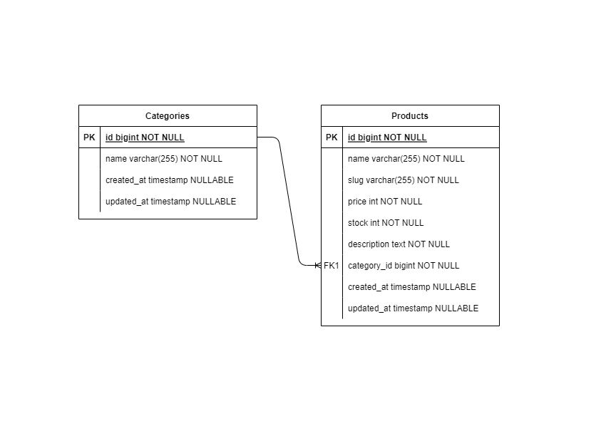
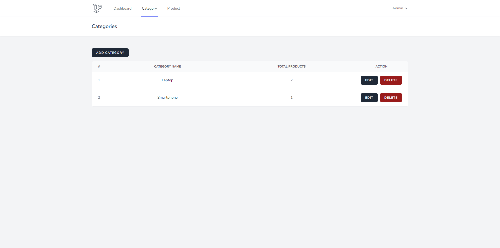
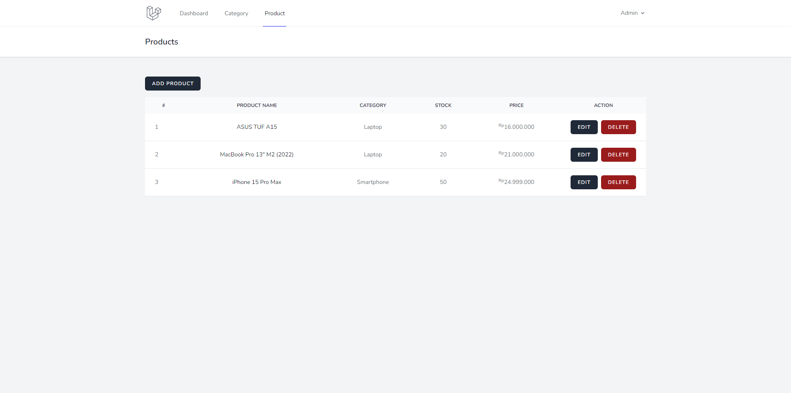

<p align="center"><a href="https://laravel.com" target="_blank"></a></p>

## About This Project

This project is a simple CRUD, RESTful API, and one-to-many relationship application that allow user to create, read, update and delete a categories. User can also create, read, update and delete a products. This project is built using **Laravel 8.0** and **Tailwind CSS**.

## Database Schema

<p align='center'>

</p>

## Screenshot

<p align='center'>


</p>

## Dependencies

-   [Laravel Breeze](https://github.com/laravel/breeze)
-   [Tailwind CSS](https://tailwindcss.com/)

## Installation

First, make sure you have [Composer](https://getcomposer.org/) and [Node.js](https://nodejs.org/en/) installed on your machine.

```bash
# clone this repository
git clone https://github.com/bymaul/dot-challenge.git

# go to the project folder
cd dot-challenge

# install dependencies
composer install

# install npm dependencies
npm install && npm run dev

# copy .env.example to .env
cp .env.example .env

# generate application key
php artisan key:generate

# create database and fill the database name in .env file
php artisan migrate

# run the application
php artisan serve
```

You can now access the application via http://localhost:8000

## License

The Laravel framework is open-sourced software licensed under the [MIT license](https://opensource.org/licenses/MIT).
